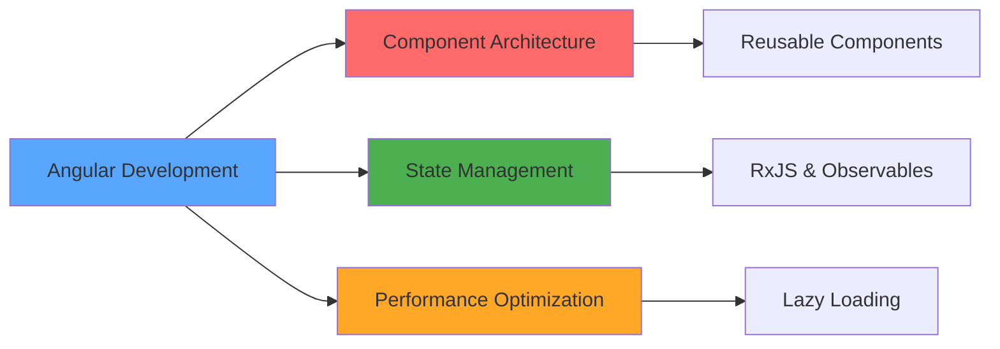

<div align="center">
  
</div>

<div align="center">
  
  [](https://git.io/typing-svg)
  
</div>

<div align="center">
  
  ### 🌐 Check out my portfolio
  [](https://stefan-helldobler.de/portfolio)
  
</div>

<br>

## 🎯 About Me

```typescript
const stefan = {
  location: "Dinslaken, Germany 🇩🇪",
  role: "Full-Stack Developer",
  code: ["TypeScript", "JavaScript", "HTML", "CSS", "SCSS"],
  frameworks: ["Angular", "Bootstrap", "Firebase"],
  architecture: ["SPA", "Progressive Web Apps", "Responsive Design"],
  currentFocus: "Building scalable web applications with Angular",
  challenge: "Exploring advanced state management and performance optimization",
  funFact: "I turn coffee into code ☕ → 💻"
};
```

<br>

## 🛠️ Tech Stack & Tools

<div align="center">

### Frontend Development


### Tools & Platforms


</div>

<br>

## 📊 GitHub Analytics

<div align="center">
  
  
</div>

<div align="center">
  
  
</div>

<br>

## 🏆 GitHub Trophies

<div align="center">
  
</div>

<br>

## 📈 Contribution Graph

<picture>
  <source media="(prefers-color-scheme: dark)" srcset="https://raw.githubusercontent.com/Stefan374245/Stefan374245/output/github-contribution-grid-snake-dark.svg">
  <source media="(prefers-color-scheme: light)" srcset="https://raw.githubusercontent.com/Stefan374245/Stefan374245/output/github-contribution-grid-snake.svg">
  
</picture>

<br>

## 🚀 Featured Projects

<div align="center">

[](https://github.com/Stefan374245/angular-based-join)

</div>

<br>

## 💼 Current Focus

<div align="center">



</div>

<br>

## 🌐 Connect With Me

<div align="center">
  
  [](https://github.com/Stefan374245)
  [](https://www.linkedin.com/in/stefan374245)
  [](https://stefan-helldobler.de/portfolio)
  [](https://discord.com/users/DEINE_DISCORD_ID)
  
</div>

<br>

## 📫 Get In Touch

<div align="center">
  
  I'm always open to interesting conversations and collaboration opportunities!
  
  💡 **Let's build something amazing together!**
  
</div>

<br>

<div align="center">
  
  ### 💭 Random Dev Quote
  
  
  
</div>

<br>

## 📊 Profile Views

<div align="center">
  
  
  
</div>

<br>

<div align="center">
  
</div>

---

<div align="center">
  
  ### ⚡ Fun Fact
  
  ```javascript
  while (alive) {
    eat();
    sleep();
    code();
    repeat();
  }
  ```
  
  **Made with ❤️ and lots of ☕**
  
</div>
